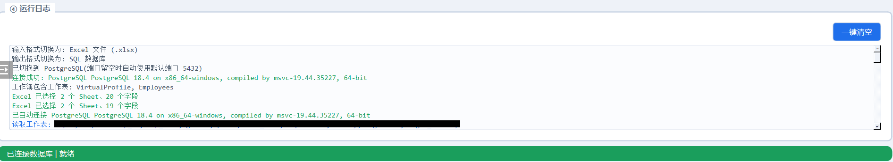
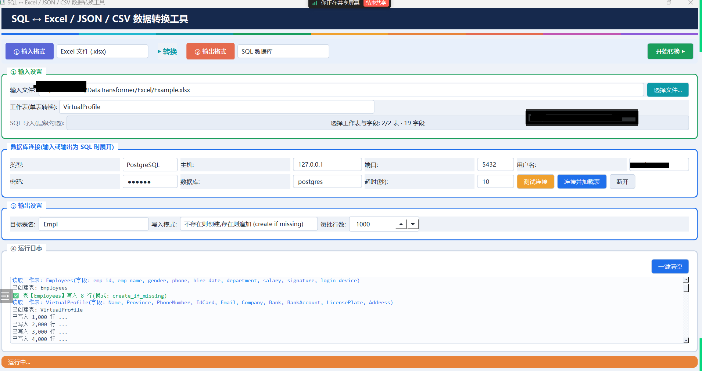

<div align="center">




<p>一个基于 PySide6 开发的 SQL / Excel / JSON / CSV 数据互转工具。</p>


</div>

<p align="center">
简体中文
</p>


# 截图

<div align="center">

</div>


# 下载

目前提供 Windows 便携版和 bat 源码运行两种方式。


## Windows

**系统要求：**

- Windows 10 及以上版本
- 仅支持 64 位（x86_64）系统

**版本说明：**

- **便携版**：`DataTransformer.exe` 为 Nuitka 打包的单文件程序，无需安装 Python，下载后双击即可使用。
- **bat 运行**：`run.bat` 使用本机 Python 直接运行源码，适合开发调试。

当前版本为 **Ver1.6.0**，历史版本归档于项目根目录 `Ver1.0.0` ~ `Ver1.6.0` 文件夹中。


# 从源码运行

首先克隆项目：

```bash
git clone https://github.com/merry8462/DataTransformer.git
cd DataTransformer
```

安装依赖：

```bash
pip install -r requirements.txt
```

> PySide6 体积较大，官方源下载慢时建议使用国内镜像：
>
> ```bash
> pip install PySide6 -i 镜像源
> ```

**启动主程序：**

```bash
python data_transformer.py
```

或双击 `run.bat`。


# 打包为 exe

双击 `build_exe.bat`，脚本会自动安装依赖并调用 Nuitka 打包（首次约 5~8 分钟）：

```powershell
build_exe.bat
```

打包产物：

```text
build\DataTransformer.exe
```

> onefile 打包失败时可删除脚本中的 `--onefile` 参数，改为目录模式分发（`build\DataTransformer.dist\DataTransformer.exe`）。


# 功能说明

支持 MySQL / PostgreSQL 与 Excel / JSON / CSV 任意互转：

| 输入 \ 输出 | Excel | JSON | CSV | SQL |
| :---: | :---: | :---: | :---: | :---: |
| SQL | ✅ | ✅ | ✅ 目录模式 | ✅ 表拷贝 |
| Excel | ✅ | ✅ | ✅ | ✅ 层级导入 |
| JSON | ✅ | ✅ | ✅ | ✅ 导入建表 |
| CSV | ✅ | ✅ | ✅ | ✅ 导入建表 |

主要特性：

- **层级勾选**：树形下拉框两层结构，第一层多选数据表（或 Excel Sheet），第二层每张表独立勾选字段；
- **Excel → SQL 层级导入**：目标表名与 Sheet 名一一对应；无同名表时自动按 Sheet 名新建，存在同名表时逐个选择 **覆盖写入 / 追加写入 / 跳过该表**；
- **目录模式 CSV 导出**：目录名 = 数据库名，目录下每个表一个 `表名.csv`；
- **同名文件纠错**：检测到同名文件时选择 覆盖整个文件 / 合并写入 / 取消；
- **大批量低内存**：服务端流式游标 + 批量入库，实测百万行级数据稳定导入导出；
- **自动建表**：按前 200 行采样推断字段类型，字符串列统一使用 TEXT，避免 "value too long" 写入失败；
- **连接配置记忆**：密码与数据库名自动记忆，下次启动自动填入；
- **一键自检**：内置 `--selftest`，验证驱动、引擎与数据库连通性；
- **安全防注入**：表名/字段名白名单校验并加引用符（MySQL 反引号 / PostgreSQL 双引号）。


## 命名约定

库-表-字段三层一一对应：

| 层级 | 对应关系 | 示例 |
| :---: | :--- | :--- |
| 数据库名 | Excel/JSON 文件名 == CSV 目录名 | `xxx.xlsx` / `xxx.json` / `xxx/` |
| 表名 | Excel Sheet 名 == JSON 一级参数 == CSV 目录下的 .csv 文件名 | `"info"` → `xxx/info.csv` |
| 字段名 | Excel 首行单元格 == JSON 二级参数 == CSV 表头单元格 | `"Id"`、`"Name"`、`"CreateTime"` |

JSON 采用**列数组**结构：

```json
{
    "info": {
        "Id": [1, 2, 3],
        "Name": ["张三", "李四", "王五"],
        "CreateTime": ["2026-08-29 21:32:35"]
    }
}
```


# 启动参数

DataTransformer 支持以下启动参数，可用于调试与故障排查。

启动参数的使用方式如下：

**源码运行：**

```bash
python data_transformer.py 参数
```

**已编译版本：**

```powershell
DataTransformer.exe 参数
```

---

## `--selftest`

无界面自检模式，用于验证打包产物中的驱动与引擎是否完整，结果写入运行目录下的 `selftest.log`。

示例：

```powershell
DataTransformer.exe --selftest
```

配合数据库环境变量可同时自检 MySQL / PostgreSQL 连通性：

```powershell
set SELFTEST_MYSQL_USER=root
set SELFTEST_MYSQL_PASSWORD=你的密码
set SELFTEST_MYSQL_DATABASE=你的库名
set SELFTEST_PG_USER=你的用户名
set SELFTEST_PG_PASSWORD=你的密码
set SELFTEST_PG_DATABASE=你的数据库名

DataTransformer.exe --selftest
```

> 不设置环境变量时，仅检查依赖导入与 Excel / JSON / CSV 写读往返。

---


# 日志与调试

程序运行日志显示在主界面"④ 运行日志"区域，可按日志级别着色显示，并支持 **一键清空**。

如果遇到导入导出异常，请保留日志内容，并在反馈问题或提交 Issue 时一并提供相关日志。


# 配置与记忆

连接成功后，程序会自动记住 **密码** 与 **数据库名**，下次启动自动填入。

配置文件位于：

```text
%APPDATA%\DataTransformer\config.json
```

删除该文件并重启程序，即可恢复首次打开状态（仅主机默认为 `127.0.0.1`，端口、用户名、密码、数据库名均为空）。

> 配置文件中密码为明文存储，请勿在多用户共用电脑上使用敏感密码。


# AI 辅助开发

本项目开发过程中使用了 DeepSeek Harness 辅助编程（Vibe Coding），包括代码编写、重构、调试、问题分析等。

项目的整体设计、功能规划、代码审查与最终维护由作者负责。


# 依赖

DataTransformer 主要使用以下项目：

- [Python](https://www.python.org/)
- [PySide6](https://doc.qt.io/qtforpython-6/)
- [PyMySQL](https://github.com/PyMySQL/PyMySQL)
- [psycopg2](https://www.psycopg.org/)
- [openpyxl](https://openpyxl.readthedocs.io/)
- [Nuitka](https://nuitka.net/)


Copyright © 2026 merry8462.
