<div align="center">

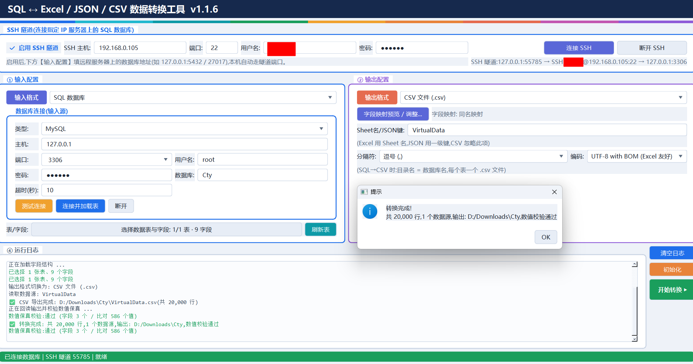

<p>MySQL / PostgreSQL / MongoDB ↔ xlsx / csv / json 双向数据转换工具（Windows 图形界面 + Linux 终端向导）。</p>
<p>长浮点数与高精度数值全程以 <code>Decimal</code> 保真，输出不出现科学计数法，并在写入后自动回读校验。</p>

</div>

<p align="center">
简体中文 | <a href="README.en.md">English</a>
</p>


<div align="center">

</div>

自上而下依次是：标题与彩色分隔条 → 
**SSH 隧道** → **① 输入配置** → **② 输出配置** → **④ 运行日志**
→ 底部状态栏。
图中是一次 **MySQL → CSV 目录模式**导出刚完成的状态。


## 数据库连接与 SSH 隧道

<div align="center">
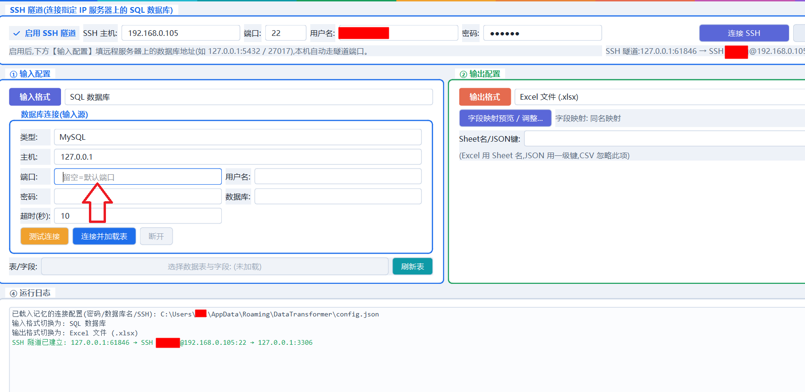
</div>

**数据库连接**卡片支持 MySQL / PostgreSQL / MongoDB；「端口」是可下拉、可手填的输入框，
**留空即自动使用该类型的默认端口**（MySQL 3306 / PostgreSQL 5432 / MongoDB 27017）。
最上方的 **SSH 隧道**卡片：勾选后填写的「主机 / 端口」是**远程服务器上**数据库的地址（通常 `127.0.0.1:5432`），
本机连接自动改走隧道端口；未连接时状态显示 `SSH 隧道:未连接`，连接后显示
`127.0.0.1:<本地端口> → SSH 用户@主机:22 → 127.0.0.1:5432`。


## 连接成功与隧道日志

<div align="center">
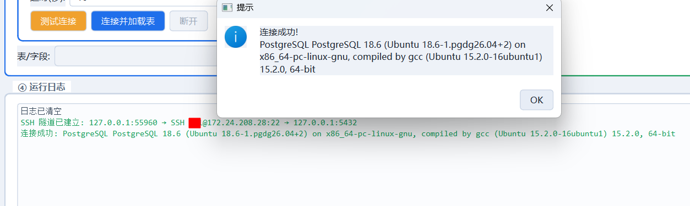
</div>

点「测试连接」后弹窗给出服务端版本（PostgreSQL 18.6），日志区同时打印
`SSH 隧道已建立: 127.0.0.1:55960 → SSH …@172.24.208.28:22 → 127.0.0.1:5432` 与
`连接成功: PostgreSQL …`。图中的用户名、密码等敏感字段已打码，实际使用时按自己的环境填写。


## 大表导出过程中的进度

<div align="center">
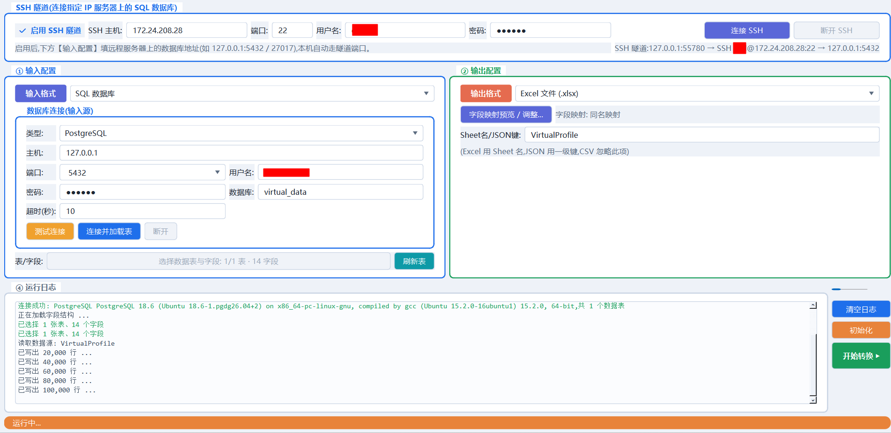
</div>

PostgreSQL（经 SSH 隧道）→ Excel：日志每 2 万行打印一次，
执行期间所有输入框与操作按钮自动置灰，既防止中途改参数让后台任务读到“半截”配置，也防止重复点击。


## 百万行表格导出

<div align="center">
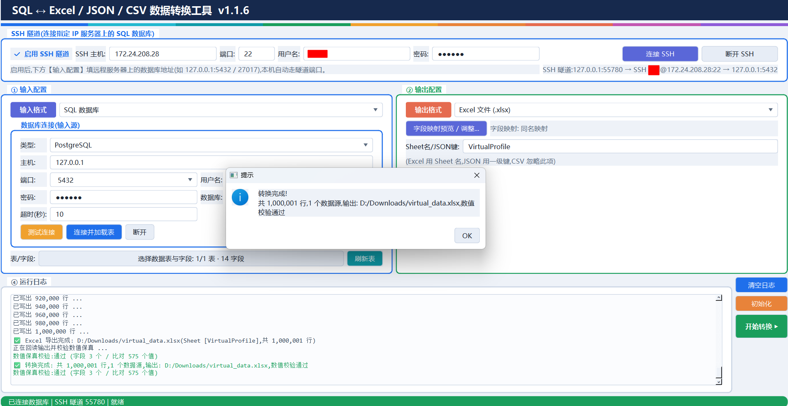
</div>

`Excel 导出完成: D:\Downloads\virtual_data.xlsx（Sheet [VirtualProfile]，共 1,000,001 行）`；
写入后自动回读输出做「数值等值 + 文本等值」双重比对，`数值保真校验：通过（字段 3 个 / 比对 575 个值）`
—— 百万行级别依然稳定：服务端流式游标不会把整表读进内存，Excel 使用 openpyxl 流式模式。


## MongoDB → JSON

<div align="center">
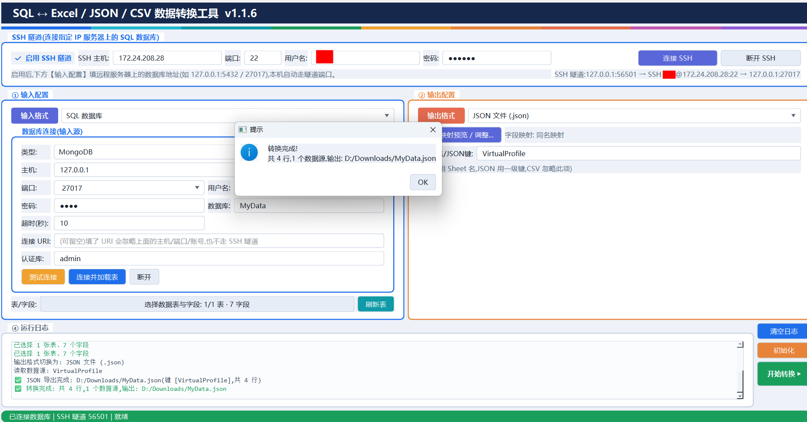
</div>

选中 MongoDB 时，数据库卡片会多出 **连接 URI** 与 **认证库 authSource** 两行（其他类型自动隐藏）。
图中经 SSH 隧道连接 `127.0.0.1:27017`、认证库，把集合导出为 `MyData.json`
（一级键 `[VirtualProfile]`，共 4 行）；集合名 ↔ JSON 一级键、文档字段 ↔ 首行表头一一对应。


## 嵌套文档 / 数组的往返对照

<div align="center">
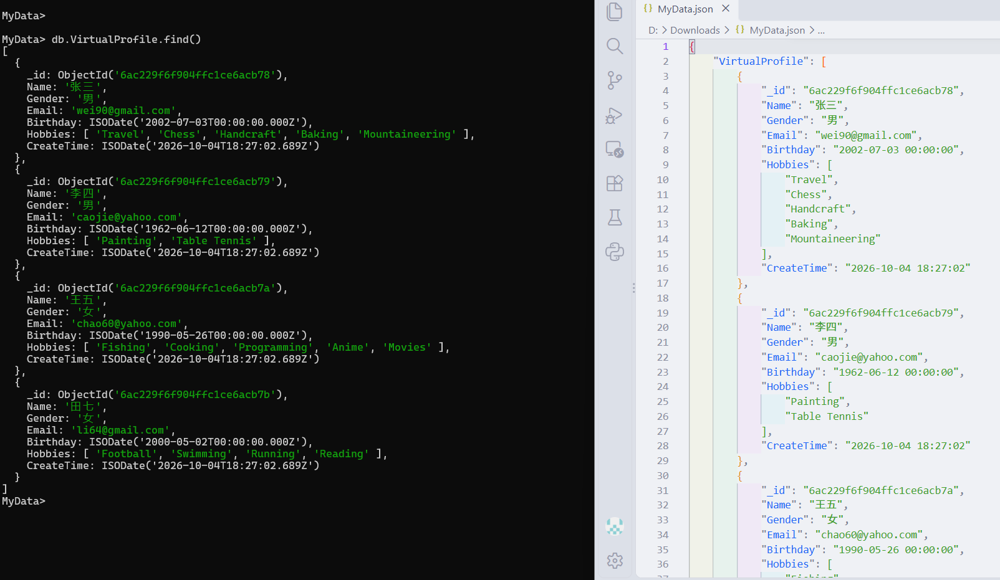
</div>

左侧是 mongosh 中的原始文档（`_id` 为 `ObjectId`、`Hobbies` 为数组、`Birthday` / `CreateTime` 为 `ISODate`），
右侧是同一集合导出的 JSON：`_id` 输出为 24 位十六进制文本，嵌套数组原样展开，
日期统一写成 `YYYY-MM-DD HH:MM:SS`。反向导入时 `_id` 会还原成 `ObjectId`，
JSON 文本单元格自动还原为嵌套结构（键名含 `.` 或以 `$` 开头时按文本保留，避免 MongoDB 键名限制导致写入失败）。


## Linux 图形界面

<div align="center">
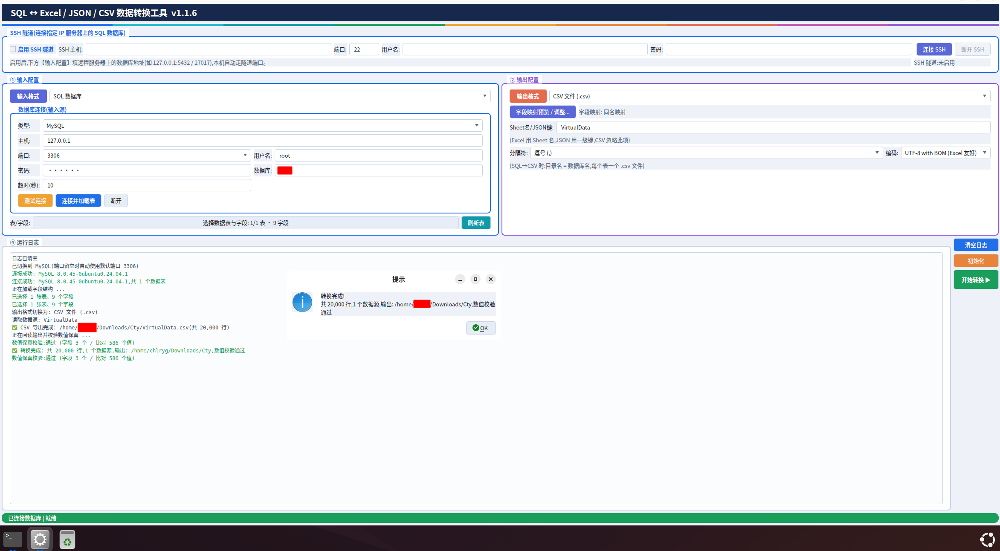
</div>

同一套界面在 Ubuntu 24.04 上运行 **MySQL → CSV 目录模式**：目录名 = 数据库名，目录下每个表一个 `.csv`
（图中导出到 `/home/.../Cty/VirtualData.csv`，共 20,000 行），底部状态栏显示「已连接数据库 | 就绪」。


## 首次启动的自动依赖安装

<div align="center">
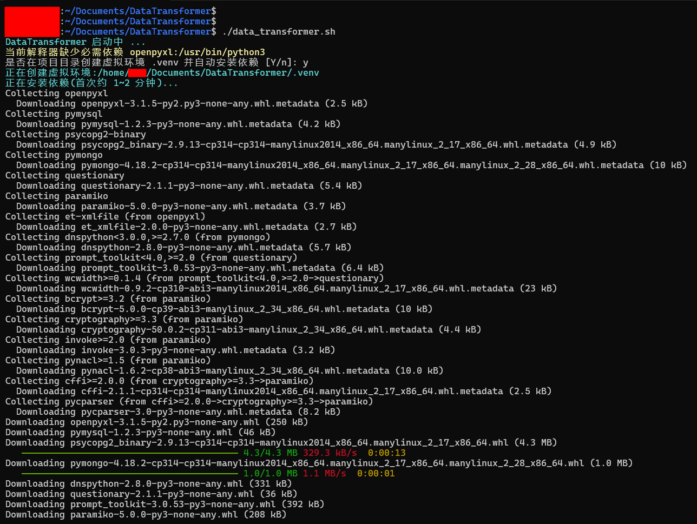
</div>

`./data_transformer.sh` 探测到系统解释器缺少必需依赖 `openpyxl` 时，会询问
「是否在项目目录创建虚拟环境 .venv 并自动安装依赖」，回车即自动创建 `.venv` 并安装
`openpyxl / pymysql / psycopg2-binary / pymongo / questionary / paramiko`；再次运行会直接复用该虚拟环境。


## GUI界面 依赖就绪后启动图形界面

<div align="center">
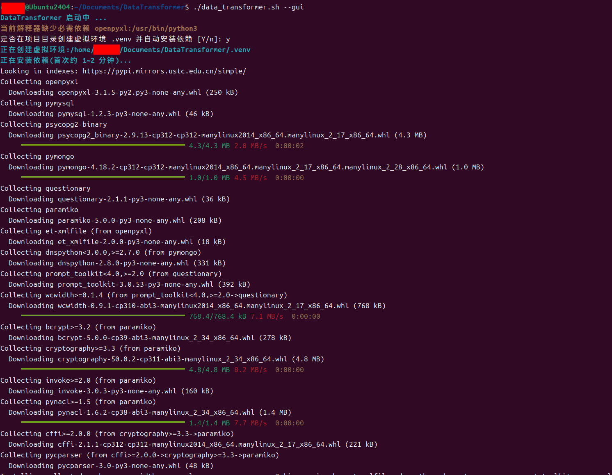
</div>

`./data_transformer.sh --gui` 走的是同一条依赖自检流程，依赖就绪后启动图形界面。
注意：**命令行向导本身不需要 PySide6**，无桌面环境的服务器用默认的 `./data_transformer.sh` 即可。


## 终端向导：选择格式 → 连接 MongoDB → 层级勾选

<div align="center">
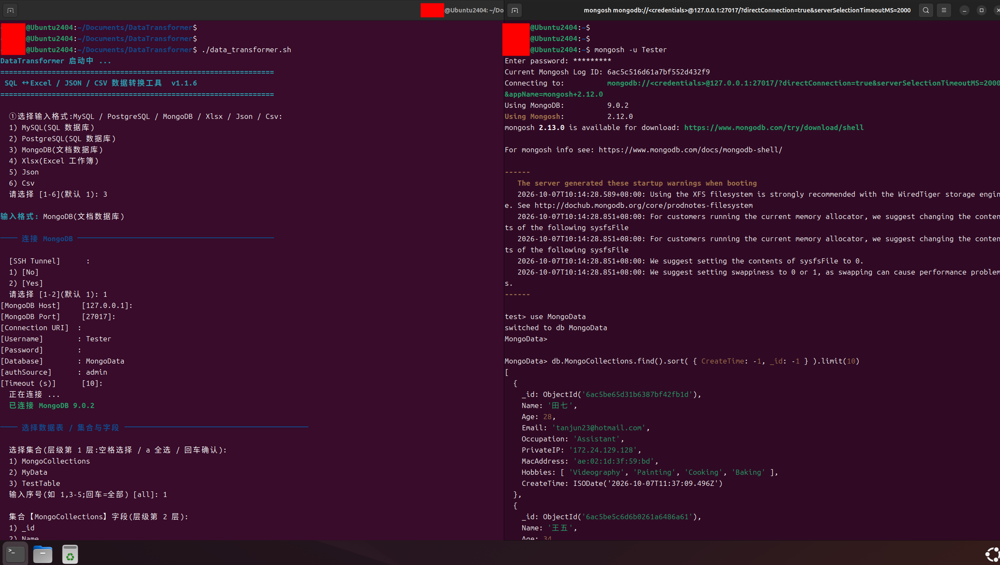
</div>

左侧是 `./data_transformer.sh` 的终端向导：① 选择输入格式（MySQL / PostgreSQL / MongoDB / Xlsx / Json / Csv）
→ `[SSH Tunnel]` 开关 → 逐个参数行（Host / Port / Connection URI / Username / Password / Database / authSource / Timeout）
→ `已连接 MongoDB 9.0.2` → ② **层级勾选**：第 1 层选集合，第 2 层给每个集合单独勾选字段。
右侧是同一时刻 mongosh 中 `MongoData.MongoCollections` 的真实文档，可与导出结果对照。


## 终端向导：导出 JSON 完成

<div align="center">
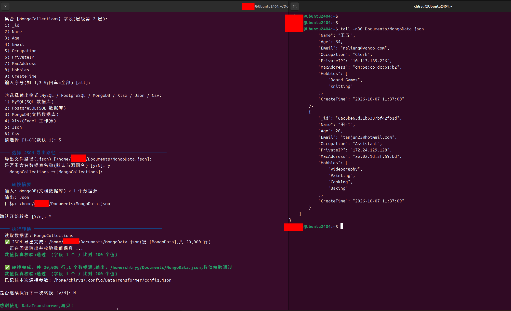
</div>

③ 选择输出格式 `Json` → 导出文件路径 → 是否重命名数据表（默认与源同名）→ **转换摘要** → 确认
→ `JSON 导出完成: …/MongoData.json（键 [MongoData]，共 20,000 行）`
→ `数值保真校验：通过（字段 1 个 / 比对 200 个值）` → `已记住本次连接参数`。
右侧是导出的 JSON 尾部内容：`_id` / 日期 / 嵌套 `Hobbies` 数组都按上一张图的规则呈现。


# 支持矩阵

| 输入 \ 输出 | xlsx | json | csv | MySQL | PostgreSQL | MongoDB |
| :---: | :---: | :---: | :---: | :---: | :---: | :---: |
| **xlsx** | — | ✅ | ✅ | ✅ 层级导入 | ✅ 层级导入 | ✅ 层级导入 |
| **json** | ✅ | — | ✅ | ✅ 导入建表 | ✅ 导入建表 | ✅ 导入集合 |
| **csv** | ✅ | ✅ | — | ✅ 导入建表 | ✅ 导入建表 | ✅ 导入集合 |
| **MySQL** | ✅ | ✅ | ✅ 目录模式 | ✅ 表拷贝 | ✅ 表拷贝 | ✅ 导入集合 |
| **PostgreSQL** | ✅ | ✅ | ✅ 目录模式 | ✅ 表拷贝 | ✅ 表拷贝 | ✅ 导入集合 |
| **MongoDB** | ✅ | ✅ | ✅ 目录模式 | — | — | ✅ 集合拷贝 |

> 数据库之间的转换在同一服务器内进行（同类型数据库直接做表 / 集合拷贝）；跨数据库类型请先用文件（xlsx / json / csv）中转。


# 项目结构

```text
DataTransformer/
├── data_transformer.py    Windows GUI 入口（PySide6 + Nuitka 打包目标）
├── dt_cli.py              Linux / macOS 终端交互式入口（questionary 动态选择）
├── dt_core.py             核心转换引擎（Reader/Writer 管道、规格、SSH、自检）+ 统一门面
├── dt_config.py           常量 / 连接配置（DBConfig、SSHConfig）/ 记忆配置（Settings）
├── dt_files.py            文件格式适配层（xlsx / csv / json 读写与值转换）
├── dt_sql.py              数据库适配层（MySQL / PostgreSQL：流式读、批量写、类型推断）
├── dt_mongo.py            MongoDB 适配层（集合枚举、Schema 采样、Decimal128 读写）
├── dt_numeric.py          高精度数值保真层（Decimal 解析 / 定点格式化 / 保真校验报告）
├── tests/                 pytest 单元测试与集成测试（含长浮点数专项）
│   ├── test_numeric.py    数值保真：尾零、超大整数、科学计数法、JSON/Excel 定点输出
│   ├── test_engine.py     转换引擎：映射规则、多表输出、跳过/目录模式、校验阻断
│   ├── test_mongo.py      MongoDB 值转换与真实服务端往返（无服务时自动跳过）
│   └── test_cli.py        命令行向导端到端交互（管道驱动）
├── data_transformer.sh    Linux / macOS 启动脚本（探测 Python、按需创建 .venv）
├── build_exe.bat          Windows 打包脚本（Nuitka onefile）
├── run.bat                Windows 源码运行
├── requirements.txt       依赖清单
└── Demo/                  示例数据与示例说明（Example.txt / Example.xlsx）
```


# 依赖清单

| 用途 | 依赖 | 说明 |
| :--- | :--- | :--- |
| 运行环境 | Python **3.10+** | 使用 `decimal`、dataclass、海象运算符等 |
| 图形界面 | PySide6 ≥ 6.6 | 仅 Windows GUI 需要 |
| 终端交互 | questionary ≥ 2.0 | 仅 Linux / macOS 命令行向导需要 |
| MySQL | PyMySQL ≥ 1.1 | 服务端流式游标（SSCursor） |
| PostgreSQL | psycopg2-binary ≥ 2.9 | 服务端命名游标（named cursor） |
| MongoDB | pymongo ≥ 4.6 | Decimal128 精确数值读写 |
| 表格文件 | openpyxl ≥ 3.1 | read_only / write_only 流式模式 |
| SSH 隧道 | paramiko ≥ 3.4（+ cryptography） | 本地端口转发 |
| 打包 | Nuitka | 仅打包时需要 |
| 测试 | pytest ≥ 8.0 | 可选 |


# 下载

目前提供 Windows 便携版、Windows bat 源码运行,以及 Linux / macOS 命令行向导三种方式。


## Windows

**系统要求：**

- Windows 10 及以上版本
- 仅支持 64 位（x86_64）系统

**版本说明：**

- **便携版**：`DataTransformer.exe` 为 Nuitka 打包的单文件程序，无需安装 Python，下载后双击即可使用。
- **bat 运行**：`run.bat` 使用本机 Python 直接运行源码，适合开发调试。


## Linux / macOS

**系统要求：**

- 主流发行版均可：Debian / Ubuntu / CentOS / Rocky / Fedora，以及 macOS
- Python 3.8+（启动脚本会自动探测 `python3` / `python3.x` / `python`）

**使用方式：**

```bash
chmod +x data_transformer.sh   # 首次使用：赋予执行权限
./data_transformer.sh          # 启动交互式命令行向导
```

执行后会展开交互式命令窗口，按提示依次选择：

```text
① 选择输入格式：MySQL / PostgreSQL / Xlsx / Json / Csv
② 选择数据表
③ 选择输出格式与写入方式
④ 选择导出路径（文件或目录）
⑤ 执行转换并输出日志
```

**启动脚本会自动完成：**

- 探测可用的 Python 3.8+ 解释器；
- 检查依赖，缺少时询问是否在项目目录创建 `.venv` 并自动安装
  （Debian / Ubuntu 新版 pip 受 PEP 668 保护，虚拟环境是最稳妥的方式，实际界面见 图 9）；
- 提示 `pymysql` / `psycopg2` / `paramiko` 的安装情况（仅影响对应的数据库 / SSH 功能，
  Excel / JSON / CSV 互转始终可用）；
- 再次运行会直接复用已建好的 `.venv`。

**常用参数：**

```bash
./data_transformer.sh --check      # 只检查运行环境，不进入向导
./data_transformer.sh --demo       # 预填 Demo/Example.txt 的 SSH + PostgreSQL 示例参数
./data_transformer.sh --selftest   # 无界面自检，结果写入 selftest.log
./data_transformer.sh --gui        # 启动图形界面（需 PySide6）
./data_transformer.sh --help       # 全部参数
```

> Linux 上的命令行向导**不需要 PySide6**，在无桌面环境的服务器上也能直接使用。


## 各发行版依赖安装

脚本会自行探测并可在项目目录创建 `.venv`；如需手动安装，可参考下表：

| 发行版 | 安装 Python 与 venv | 安装依赖 |
| :--- | :--- | :--- |
| Ubuntu / Debian | `sudo apt update && sudo apt install -y python3 python3-venv python3-pip` | `python3 -m venv .venv && .venv/bin/pip install -r requirements.txt` |
| CentOS / Rocky | `sudo dnf install -y python3 python3-pip` | 同上（CentOS 7 建议先 `sudo yum install -y centos-release-scl`） |
| Fedora | `sudo dnf install -y python3 python3-pip` | 同上 |
| macOS | `brew install python` | 同上 |

> psycopg2 在少数发行版需要编译依赖：Debian/Ubuntu 用 `sudo apt install -y libpq-dev`，
>
> 免虚拟环境快速安装核心依赖（不含 PySide6）：
>
> ```bash
> python3 -m pip install --user openpyxl pymysql psycopg2-binary pymongo questionary paramiko
> ```


# 从源码运行

首先克隆项目：

```bash
git clone https://github.com/merry8462/DataTransformer.git
cd DataTransformer
```

安装依赖：

```bash
pip install -r requirements.txt
```

> ```bash
> pip install PySide6 -i 镜像源
> ```

**启动主程序：**

```bash
python data_transformer.py
```

或双击 `run.bat`。

Linux / macOS 上也可以跳过图形界面直接运行向导（无需 PySide6）：

```bash
pip install openpyxl pymysql psycopg2-binary pymongo questionary paramiko   # 只装核心依赖
python3 dt_cli.py                                       # 等价于 ./data_transformer.sh
python3 dt_cli.py --demo                                # 带 Demo 示例参数
python3 dt_cli.py --plain                               # 强制纯文本问答
python3 dt_cli.py --selftest                            # 无界面自检
```


# 打包为 exe

双击 `build_exe.bat`，脚本会自动安装依赖并调用 Nuitka 打包（首次约 5~8 分钟）：

```powershell
build_exe.bat
```

打包产物：

```text
build\DataTransformer.exe
```

> **发布包**：`release\DataTransformer_v1.1.6_win64.zip`（内含 `DataTransformer.exe` + 面向最终用户的
> `README.txt` + `SHA256SUMS.txt`），另有面向维护者的 Markdown 发布说明 `release\README.md`。
> 解压后核对哈希并执行 `--selftest` 即可确认产物完整。


# 功能说明

支持 MySQL / PostgreSQL / MongoDB 与 Excel / JSON / CSV 任意互转：

| 输入 \ 输出 | Excel | JSON | CSV | SQL 数据库 | MongoDB |
| :---: | :---: | :---: | :---: | :---: | :---: |
| SQL | ✅ | ✅ | ✅ 目录模式 | ✅ 表拷贝 | ✅ 导入集合 |
| MongoDB | ✅ | ✅ | ✅ 目录模式 | — | ✅ 集合拷贝 |
| Excel | ✅ | ✅ | ✅ | ✅ 层级导入 | ✅ 层级导入 |
| JSON | ✅ | ✅ | ✅ | ✅ 导入建表 | ✅ 导入集合 |
| CSV | ✅ | ✅ | ✅ | ✅ 导入建表 | ✅ 导入集合 |

主要特性：

- **层级勾选**：树形下拉框两层结构，第一层多选数据表 / 集合（或 Excel Sheet），第二层每张表独立勾选字段；
- **长浮点数保真**：全程 `Decimal` 中转，不丢尾零、不截断有效数字、**输出不出现科学计数法**，写入后自动回读做「数值等值 + 文本等值」双重校验并输出差异报告（详见下文专项说明）；
- **字段映射**：自动按同名映射（Sheet 名 ↔ 表名、首行表头 ↔ 数据库字段名），支持手动覆盖并做重名校验；
- **SSH 隧道**：连接指定 IP 服务器上的 MySQL / PostgreSQL / MongoDB，无需在服务器上开放数据库端口；
- **命令行向导**：`./data_transformer.sh` 通过 **questionary** 动态选择 Input/Output 格式、连接参数、表 / 集合与字段；
- **Excel → SQL 层级导入**：目标表名与 Sheet 名一一对应；无同名表时自动按 Sheet 名新建，存在同名表时逐个选择 **覆盖写入 / 追加写入 / 跳过该表**；
- **目录模式 CSV 导出**：目录名 = 数据库名，目录下每个表一个 `表名.csv`；
- **同名文件纠错**：检测到同名文件时选择 覆盖整个文件 / 合并写入 / 取消；
- **大批量低内存**：服务端流式游标 + 批量入库，实测百万行级数据稳定导入导出；
- **自动建表**：按前 200 行采样推断字段类型（`int → BIGINT/INT`、`Decimal → NUMERIC/DECIMAL`、`float → DOUBLE`、日期时间 → `TIMESTAMP/DATE`，字符串统一 `TEXT`）；
- **MongoDB 嵌套结构**：嵌套文档 / 数组导出为 JSON 文本单元格，导入时自动还原为嵌套结构；
- **连接配置记忆**：密码、数据库名与 SSH 参数自动记忆，下次启动自动填入；
- **连接异常友好提示**：主机 / 端口 / 用户名 / 密码 / 数据库名错误自动识别并弹出中文定位提示（同时保留原始错误）；
- **按钮状态联动**：输入 / 输出未就绪、数据库信息未填全、未连接或任务执行中时，相关按钮自动置灰，防止重复操作；
- **一键自检**：内置 `--selftest`，验证驱动、引擎、文件互转与数值保真；
- **安全防注入**：表名 / 字段名白名单校验并加引用符（MySQL 反引号 / PostgreSQL 双引号）。


## 命名约定

库-表-字段三层一一对应：

| 层级 | 对应关系 | 示例 |
| :---: | :--- | :--- |
| 数据库名 | Excel/JSON 文件名 == CSV 目录名 == MongoDB 数据库 | `xxx.xlsx` / `xxx.json` / `xxx/` |
| 表名 | 数据库表名 == MongoDB 集合名 == Excel Sheet 名 == JSON 一级键 == CSV 文件名 | `"info"` → `xxx/info.csv` |
| 字段名 | 数据库字段名 == MongoDB 文档字段 == Excel 首行单元格 == JSON HeaderFields == CSV 表头 | `"Id"`、`"Name"`、`"CreateTime"` |

> 映射默认**按同名自动匹配**，并可在图形界面「字段映射预览 / 调整」或命令行向导中选择手动覆盖
> （例如把 `姓名` 映射为 `Name`）；映射后的重名字段会在写入前被拦截并提示。

JSON 采用**表头 + 行记录**结构：

```json
{
    "info": {
        "HeaderFields": ["Id", "Name", "CreateTime"],
        "Data": {
            "Row1": [1, "张三", "2026-08-29 21:32:35"],
            "Row2": [2, "李四", "2026-08-29 21:32:36"]
        }
    }
}
```

> `HeaderFields` 为字段名列表，`Data` 中的 `RowN` 为第 N 行数据数组（行号从 1 开始）。
> 旧版**列数组**结构（`{"字段名": [值...]}`）仍可正常读取，向后兼容。


# 长浮点数保真与科学计数法规避

高精度数值（多位小数、超大整数、以科学计数法书写的字符串）在任意方向转换后都必须**数值等值、文本一致**。
实现要点（代码见 `dt_numeric.py`）：

| 环节 | 规则 |
| :--- | :--- |
| 中间表示 | 一律使用 `decimal.Decimal` 或 Python 任意精度 `int`，**禁止二进制 `float` 作为中转容器**；只能拿到 float 时（Excel 单元格、FLOAT 列）经 `Decimal(str(value))` 取十进制字面量 |
| 解析 | CSV 文本按 `parse_number` 判定：整数 → `int`，小数 / 科学计数法 → `Decimal`；JSON 读取使用 `parse_float=Decimal`；`007` 这类补零编号识别为**文本**，不丢前导零 |
| 格式化 | 所有输出统一经 `format_number` 以**定点十进制**呈现：`1.500` 保留尾零、`1E+20` 展开为 `100000000000000000000`，永不出现 `e` / `E` |
| JSON 写出 | 使用自带序列化器 `dumps_json`（标准库无法直接输出 Decimal 数字），保证 JSON 里的数字同样是定点形式 |
| Excel 写出 | 建表时 `Decimal` → `NUMERIC/DECIMAL`（不是 DOUBLE）；单元格中超过 15 位有效数字或带尾零的数值按**文本**写出（Excel 内部是双精度，写数值必然被截断/吞尾零） |
| 数据库写出 | `Decimal` 交给驱动参数化写入（psycopg2 / PyMySQL / pymongo 的 `Decimal128`），不经 float；超出 `Decimal128`(34 位) 或 `int64` 范围的 Mongo 数值自动降级为文本保真 |
| 回读校验 | 写入后自动回读输出，按字段做「数值等值 + 文本等值」双重比对；发现精度丢失 / 截断 / 科学计数法即**阻断流程并输出差异报告**（可用 `allow_mismatch` 放行，命令行会询问是否保留结果） |

示例输出（输入 `1.500` 与 `12345678901234567890.12345`，经 CSV → JSON → Excel → CSV 往返后完全一致）：

```json
{
    "info": {
        "HeaderFields": ["Id", "Amount"],
        "Data": {
            "Row1": [1, 12345678901234567890.12345],
            "Row2": [2, 1.500]
        }
    }
}
```

> 校验报告形如：`数值保真校验:通过 (字段 2 个 / 比对 4 个值)`；未通过时列出差异样例，例如
> `Amount 行1: 输入 '1.500' → 输出 '1.5'(文本表示变化)`。


# SSH 连接远程数据库

针对「数据库只监听 `127.0.0.1`、必须先 SSH 登录服务器才能访问」的场景,程序内置 SSH 本地端口转发：
勾选 **启用 SSH 隧道** 后,【数据库连接】里的主机/端口填写**远程服务器上**数据库的地址（通常 `127.0.0.1:5432`）,
本机连接会自动改走隧道端口,导入导出流程与本地数据库完全一致。


## 图形界面操作步骤

1. 窗口最上方是【SSH 隧道】卡片（见 图 2），勾选 **启用 SSH 隧道**；
2. 填写 SSH 主机/IP、端口（默认 22）、用户名、密码（本工具统一使用「用户名 + 密码」认证，
   命令行向导 / 引擎仍保留私钥参数，图形界面不提供私钥选择）；
3. 点击 **连接 SSH**，状态区显示 `127.0.0.1:<本地端口> → SSH 用户@主机:22 → 127.0.0.1:5432`（见 图 3）；
4. 回到【数据库连接】填写远程库的地址 / 端口 / 用户名 / 密码 / 数据库名，点击 **连接并加载表**；
5. 之后按普通流程勾选「表 → 字段」，导出或导入即可（大表导出进度见 图 4、图 5）。

> 隧道只监听本机 `127.0.0.1`,不会对外网暴露端口;点击 **断开 SSH** 或关闭程序会自动释放隧道。


## 命令行向导

`./data_transformer.sh` 在询问连接参数时会先问「是否通过 SSH 隧道连接远程服务器」,交互与图形界面一致;
加 `--demo` 可直接预填上表参数（完整交互见 图 11、图 12）：

```bash
./data_transformer.sh --demo
```

> SSH 功能依赖 `paramiko`（`pip install paramiko`）。未安装时按钮置灰并给出提示,文件互转不受影响。


# 启动参数

DataTransformer 支持以下启动参数，可用于调试与故障排查。

启动参数的使用方式如下：

**源码运行：**

```bash
python data_transformer.py 参数
```

**已编译版本：**

```powershell
DataTransformer.exe 参数
```

---

## `--selftest`

无界面自检模式，用于验证打包产物中的驱动与引擎是否完整，结果写入运行目录下的 `selftest.log`。

示例：

```powershell
DataTransformer.exe --selftest
```

配合数据库环境变量可同时自检 MySQL / PostgreSQL 连通性：

```powershell
set SELFTEST_MYSQL_USER=root
set SELFTEST_MYSQL_PASSWORD=你的密码
set SELFTEST_MYSQL_DATABASE=你的库名
set SELFTEST_PG_USER=你的用户名
set SELFTEST_PG_PASSWORD=你的密码
set SELFTEST_PG_DATABASE=你的数据库名

DataTransformer.exe --selftest
```

> 不设置环境变量时，仅检查依赖导入与 Excel / JSON / CSV 写读往返。

---

## `--version`

打印版本号后退出，便于脚本化调用：

```powershell
DataTransformer.exe --version
```

Linux / macOS 下等价的写法：

```bash
./data_transformer.sh --version
```

---


# 日志与调试

程序运行日志显示在主界面"④ 运行日志"区域，可按日志级别着色显示，并支持 **一键清空**。

如果遇到导入导出异常，请保留日志内容，并在反馈问题或提交 Issue 时一并提供相关日志。


# 配置与记忆

连接成功后，程序会自动记住连接参数（Windows 图形界面记忆 **密码** 与 **数据库名**；
命令行向导还会记忆 **主机 / 端口 / 用户名 / MongoDB URI / authSource / SSH 参数**），下次启动自动填入。

配置文件位于：

```text
Windows      : %APPDATA%\DataTransformer\config.json
Linux / macOS: $XDG_CONFIG_HOME/DataTransformer/config.json（默认 ~/.config/DataTransformer/config.json）
```

删除该文件并重启程序，即可恢复首次打开状态（仅主机默认为 `127.0.0.1`，端口、用户名、密码、数据库名均为空）。

> 配置文件中密码为**明文**存储，请勿在多用户共用电脑上使用敏感密码。
> Linux / macOS 下写入配置时会自动把权限收紧为 `600`（仅本人可读写），并采用“先写临时文件再原子替换”的方式避免写坏配置。


# 安全说明

- **标识符校验**：所有表名 / 字段名先做白名单校验（`字母 / 下划线 / 中文` 开头，只允许字母、数字、下划线），
  再按数据库方言加引用符（MySQL 反引号 / PostgreSQL 双引号），避免拼接 SQL 造成注入。
  因此 Excel Sheet 名与表头列名若含空格、括号、横线等字符，需要先重命名再导入数据库
  （导出为 JSON / CSV / Excel 不受此限制）；
- **SSH 隧道**：本地监听地址固定为 `127.0.0.1`，不对局域网暴露端口；
- **配置权限**：Linux / macOS 下配置文件权限收紧为 `600`；
- **CSV 公式注入**：导出的 CSV / Excel 会**原样保留**数据内容。若源数据中带有以 `=`、`+`、`-`、`@`
  开头的文本，直接用 Excel 打开时可能被当作公式执行——这是 Excel 的既有行为。处理不受信任的数据时，
  请先用文本编辑器查看，或改用 JSON 格式导出。


# 测试

```bash
python -m pytest tests/ -q          # 全部单元测试与集成测试
python -m pytest tests/test_numeric.py -q   # 长浮点数保真专项
python dt_core.py                   # 无界面自检(等价 --selftest),结果写入 selftest.log
```

| 测试文件 | 覆盖内容 |
| :--- | :--- |
| `tests/test_numeric.py` | Decimal 解析 / 定点格式化 / 尾零与前导零规则 / JSON 定点序列化 / Excel 单元格策略 / 保真报告与多重集比对 |
| `tests/test_engine.py` | 长浮点数跨 xlsx / json / csv 往返、科学计数法归一化、保真校验阻断与放行、字段与名称映射、多表输出、跳过与目录模式、错误护栏 |
| `tests/test_mongo.py` | MongoDB 值转换（Decimal128 / int64 溢出 / 嵌套结构 / 不安全键名）、`_id` 处理，以及**真实服务端**往返（本机无 mongod 时自动跳过） |
| `tests/test_cli.py` | 命令行向导端到端交互（管道驱动）：完整流程、输出路径、取消不落盘、无栈回溯 |
| `tests/test_gui.py` | 图形界面关键逻辑（离屏运行）：窗口构造、三种数据库配置切换、SSH 隧道改写连接目标、字段映射、层级勾选、进度条生命周期 |

> 集成测试需要真实环境：PostgreSQL / MySQL / MongoDB 用例在缺少服务或环境变量时会自动跳过，不会导致失败。


# 常见问题

| 现象 | 处理办法 |
| :--- | :--- |
| `ModuleNotFoundError: No module named 'questionary'` | Linux 向导依赖 questionary：`pip install questionary`，或直接用 `./data_transformer.sh`（会自动安装） |
| `ModuleNotFoundError: No module named 'pymongo'` | 需要 MongoDB 功能时安装：`pip install pymongo`；不使用 MongoDB 可忽略 |
| 提示「非法标识符」 | 表名 / 字段名（含 Excel Sheet 名与表头）必须由字母、下划线或中文开头，且只含字母、数字、下划线；含空格 / 括号 / 横线时请先重命名，或改用 JSON / CSV / Excel 输出 |
| Excel 打开导出的文件，长数字变形或以科学计数法显示 | 本工具写出的长数值是**文本单元格**（Excel 无法精确表示超过 15 位有效数字）；如需保持数值语义请用 JSON / CSV，或在 Excel 中把该列设为文本格式再导入 |
| `数值保真校验未通过` | 说明输出侧发生了精度丢失 / 尾零丢失 / 科学计数法；日志与弹窗会列出差异样例，请检查目标列类型（应使用 NUMERIC / DECIMAL 而非 DOUBLE）或改用文本列 |
| MySQL/PostgreSQL 导入报 `value too long` | 目标表字符串列长度不足；自动建表已统一使用 TEXT，手工建表请把该列改宽 |
| 中文乱码 | Windows 终端先执行 `chcp 65001`；CSV 编码选择 `UTF-8 with BOM` 或 `GBK` |
| `无法连接 MongoDB ... ServerSelectionTimeoutError` | 检查 mongod 是否启动、端口与 `authSource`；远程场景可勾选 SSH 隧道 |
| 百万行数据导入很慢 | 调大「每批行数」（默认 1000，可设 5000~20000）；数据库侧注意 `max_allowed_packet`（MySQL）与磁盘 IO |


# 验收清单

- [x] Windows 10/11 图形界面（PySide6）：Input 参数区、Output 参数区、运行日志 + 开始转换按钮、进度条；
- [x] Windows 使用 Nuitka 打包为单文件可执行程序（`build_exe.bat`，自动校验大小与 SHA-256）；
- [x] Linux / macOS 终端交互式工具（`data_transformer.sh` → `dt_cli.py`），**questionary** 动态选择格式与参数，无需图形界面；
- [x] 覆盖 Ubuntu、Debian、Fedora、CentOS 的依赖安装与运行说明；
- [x] 适配 MySQL、PostgreSQL、**MongoDB**，以及 xlsx、csv、json 文件；
- [x] 数据库 ↔ 文件双向转换（含 SQL→SQL 表拷贝、MongoDB 集合拷贝、文件间互转）；
- [x] 映射规则：xlsx `sheetname` ↔ 数据库表名 / MongoDB 集合名；首行表头 ↔ 数据库字段名；CSV / JSON 提供等价映射并提供手动覆盖；
- [x] 长浮点数与高精度数值保真：数值等值 + 文本一致、不丢尾零、不截断有效数字、不出现 `e`/`E` 科学计数法；
- [x] 提供可见的数值校验机制与差异报告（写入后回读比对，失败可阻断或确认放行）；
- [x] 数据类型转换、空值、日期时间、编码、批量写入、错误处理、日志与进度提示；
- [x] 单元测试与集成测试（含长浮点数专项与真实数据库往返）；


# AI 辅助开发

本项目开发过程中使用了 DeepSeek Harness 辅助编程（Vibe Coding），包括代码编写、重构、调试、问题分析等。

项目的整体设计、功能规划、代码审查与最终维护由作者负责。


# 依赖

DataTransformer 主要使用以下项目：

- [Python](https://www.python.org/)
- [PySide6](https://doc.qt.io/qtforpython-6/)
- [questionary](https://questionary.readthedocs.io/)（终端动态交互）
- [PyMySQL](https://github.com/PyMySQL/PyMySQL)
- [psycopg2](https://www.psycopg.org/)
- [pymongo](https://pymongo.readthedocs.io/)（MongoDB）
- [openpyxl](https://openpyxl.readthedocs.io/)
- [paramiko](https://www.paramiko.org/)（SSH 隧道）
- [Nuitka](https://nuitka.net/)


Copyright © 2026 merry8462.
